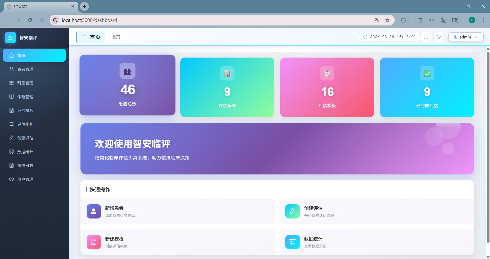
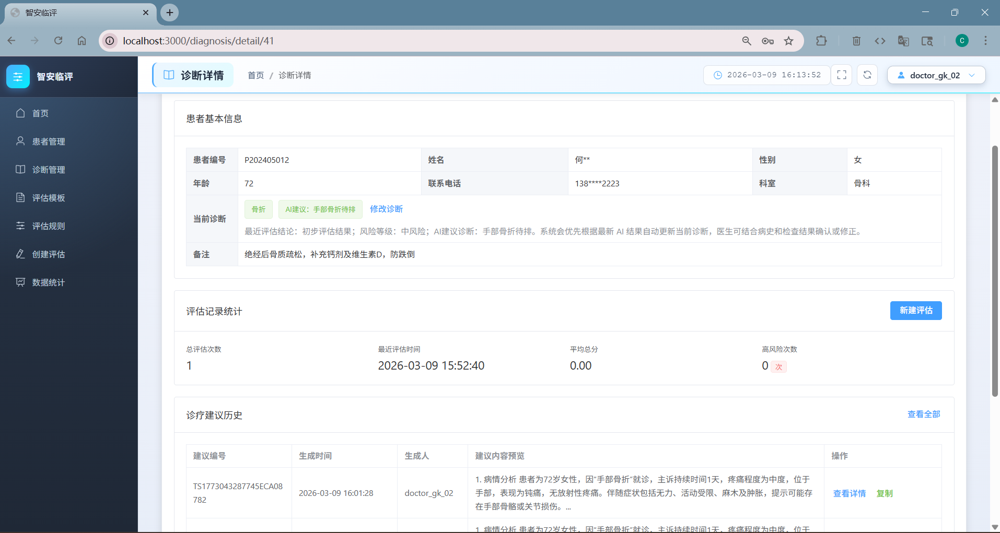
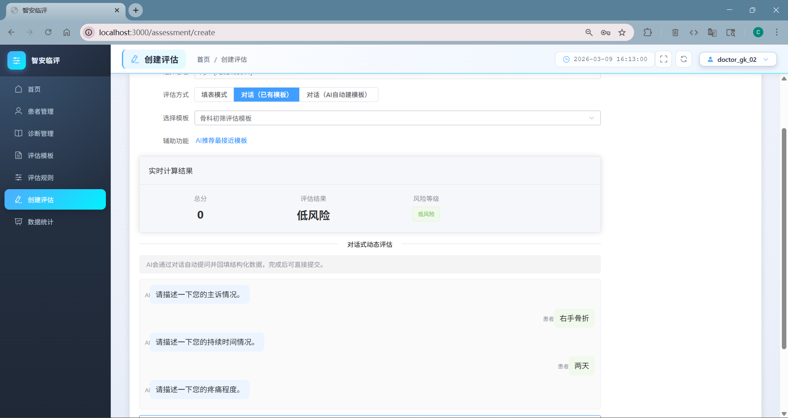
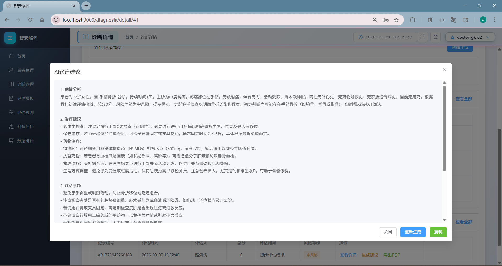
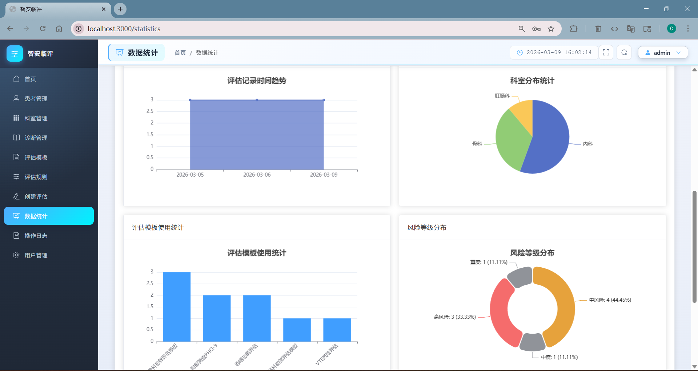
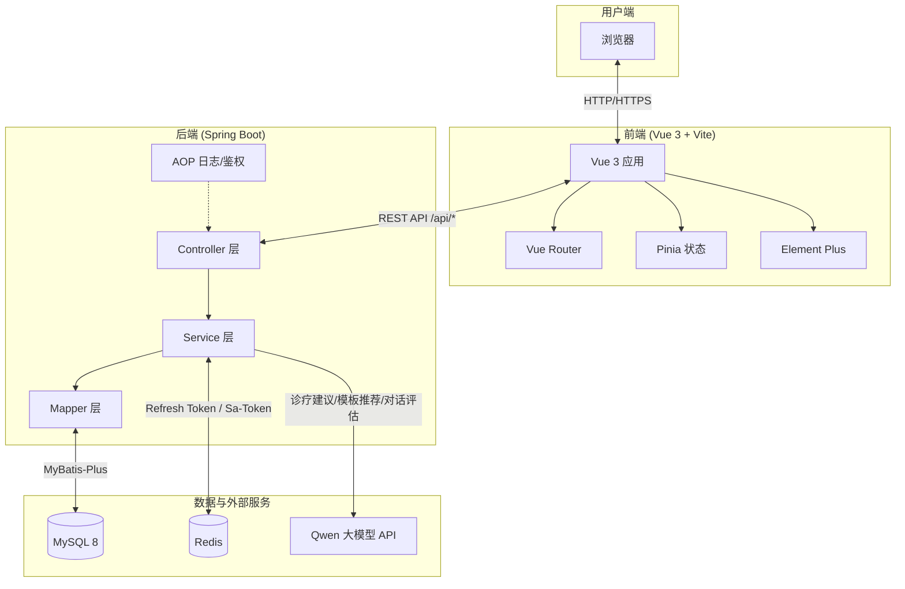
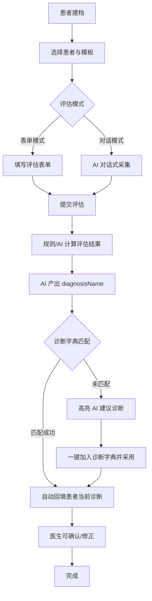
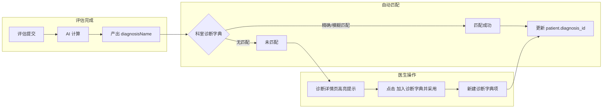
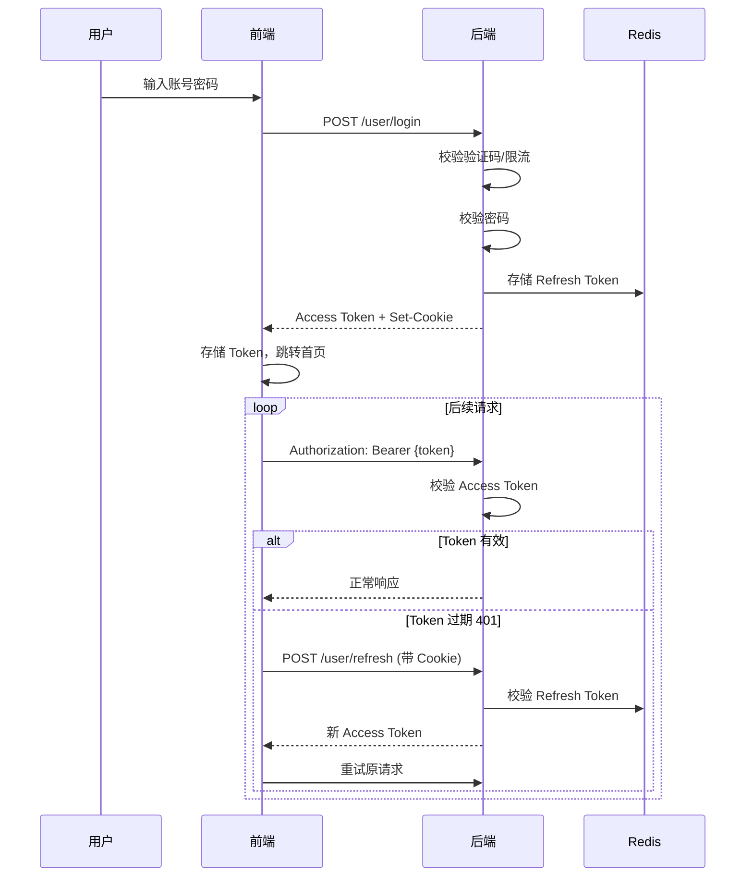

# 智安临评

智安临评是一个面向医院临床场景的前后端分离式结构化临床评估平台，正式名称为《结构化临床评估工具系统》，用于完成患者信息管理、评估模板配置、评估规则计算、评估记录留存、报告导出、统计分析以及 AI 辅助评估与诊疗建议生成。

项目当前由 `frontend` 和 `backend` 两个子项目组成：

- `frontend`：基于 Vue 3 + Vite + Element Plus 的管理端前端
- `backend`：基于 Spring Boot + MyBatis-Plus + MySQL 的 REST API 服务

## 项目特性

- 支持管理员、医生、护士三类角色的权限控制
- 支持患者基础信息管理与诊断关联
- 支持 **AI 评估完成后自动匹配诊断字典并回填患者当前诊断**
- 支持 **AI 建议诊断未匹配时一键加入诊断字典并同步到患者**
- 支持评估模板、字段、模板版本的管理
- 支持评估规则配置、规则测试与实时计算
- 支持评估草稿保存、提交、历史查询与对比
- 支持 PDF / Word 报告预览与导出
- 支持统计分析面板与风险预警
- 支持操作日志留痕
- 支持验证码登录、Access Token + Refresh Token 会话续期
- 支持对话式评估、AI 模板推荐（含自动生成评分/风险规则）、AI 诊疗建议生成
- 支持患者敏感字段 AES 加密存储

## 技术栈

### 前端

- Vue 3
- Vite 4
- Element Plus
- Vue Router 4
- Pinia
- Axios
- ECharts / vue-echarts

### 后端

- Spring Boot 2.7.18
- MyBatis-Plus 3.5.3.1
- MySQL 8
- Druid
- Sa-Token
- Spring Validation
- Spring AOP
- Spring Security Crypto
- Fastjson2
- iTextPDF
- Apache POI
- Nashorn

## 功能模块

### 1. 用户与权限

- 用户登录、登出、刷新会话
- 登录失败限流
- 验证码校验
- 用户增删改查
- 密码修改
- 基于角色的菜单与接口访问控制

### 2. 患者管理

- 患者列表分页查询
- 患者新增、编辑、删除
- 患者诊断维护（支持从诊断字典选择或一键采用 AI 建议）
- 患者历史评估记录查看

### 3. 评估模板管理

- 模板列表、详情查看
- 模板新增、编辑、删除
- 模板启停用
- 模板字段管理
- 模板版本管理

### 4. 评估规则管理

- 规则分页查询
- 规则新增、编辑、删除
- 规则启停用
- 规则测试
- 表单实时计算

### 5. 评估记录

- 创建评估草稿
- 保存评估
- 提交评估
- 患者历史记录查询
- 多条记录对比

### 6. 报告管理

- PDF 预览 / 导出
- Word 预览 / 导出
- 报告模板管理
- 默认模板设置

### 7. 统计分析

- 首页统计看板
- 按时间统计
- 按科室统计
- 按模板统计
- 按风险等级统计
- 指标趋势与指标分布
- 风险预警

### 8. AI 能力与诊断联动

- 对话式评估流程
- AI 推荐评估模板
- AI 生成评估模板（含自动生成评分规则与风险规则）
- AI 实时辅助计算
- AI 诊疗建议生成与重生成
- **AI 生成模板时同步生成 SCORE 和 RISK 规则，确保评分由规则引擎执行，结果确定可解释**
- **AI 评估完成后自动提取 `diagnosisName`，按科室诊断字典匹配并回填患者当前诊断**
- **AI 建议诊断未匹配时，高亮提示并支持一键加入诊断字典、同步到患者**

### 9. 审计与安全

- 操作日志记录
- Access Token 鉴权
- Refresh Token 续期
- 患者敏感字段 AES 加密

## 重要功能截图

| 功能 | 截图 |
|------|------|
| 首页看板 — 统计概览 |  |
| 诊断详情 — 当前诊断、AI 建议、一键加入字典 |  |
| 创建评估 — 表单/对话式评估 |  |
| AI 诊疗建议 — 诊疗建议展示与操作 |  |
| 数据统计 — 统计看板与风险预警 |  |


## 系统架构图

系统采用前后端分离架构，前端通过 REST API 与后端交互，后端连接 MySQL、Redis 及外部 Qwen 大模型服务。



> 更多架构图与工作流程图详见 [docs/diagrams.md](docs/diagrams.md)。

### 架构说明


| 层级  | 组件                          | 职责                           |
| --- | --------------------------- | ---------------------------- |
| 用户端 | 浏览器                         | 访问前端页面，发起请求                  |
| 前端层 | Vue 3 + Vite + Element Plus | 页面渲染、路由、状态管理、接口调用            |
| 后端层 | Spring Boot + MyBatis-Plus  | REST API、业务逻辑、数据持久化、鉴权与日志    |
| 数据层 | MySQL                       | 业务数据存储                       |
| 数据层 | Redis                       | Refresh Token、Sa-Token 会话持久化 |
| 数据层 | Qwen API                    | AI 诊疗建议、对话式评估、模板推荐           |


## 核心工作流程

### 1. 患者评估与诊断确认流程

从患者建档到评估完成、AI 诊断回填及医生确认的完整流程。



### 2. 诊断字典与 AI 联动流程

AI 建议诊断与诊断字典的匹配、回填及一键加入逻辑。



### 3. 登录与会话续期流程



> 核心数据流图（评估流程、规则引擎、AI 能力、安全机制等 10 张详细图）详见 [docs/core-data-flows.md](docs/core-data-flows.md)。

## 系统角色

系统内置三类角色：

- `ADMIN`：管理员，拥有全量管理权限
- `DOCTOR`：医生，可管理评估、规则、报告、诊疗建议等业务
- `NURSE`：护士，可查看和参与部分评估、统计、诊疗建议相关流程

从代码与前端菜单表现看：

- 科室管理、用户管理、操作日志主要面向 `ADMIN`
- 评估规则、创建评估主要面向 `ADMIN` / `DOCTOR`
- 统计、患者、诊断、部分 AI 能力允许 `ADMIN` / `DOCTOR` / `NURSE`

## 项目结构

```text
bed/
├── backend/                         # Spring Boot 后端
│   ├── pom.xml
│   └── src/main/
│       ├── java/com/medical/assessment/
│       │   ├── annotation/          # 自定义注解
│       │   ├── aop/                 # AOP 日志等切面
│       │   ├── common/              # 通用返回体与基础实体
│       │   ├── config/              # Web、鉴权、加密等配置
│       │   ├── controller/          # REST 接口
│       │   ├── dto/                 # 数据传输对象
│       │   ├── entity/              # 数据实体
│       │   ├── exception/           # 全局异常处理
│       │   ├── handler/             # 自定义类型处理器
│       │   ├── interceptor/         # 登录与权限拦截
│       │   ├── mapper/              # MyBatis Mapper
│       │   ├── service/             # 业务服务
│       │   └── util/                # 工具类
│       └── resources/
│           ├── application.yml      # 主配置
│           ├── application-dev.yml  # 开发环境配置
│           ├── application-prod.yml # 生产环境配置
│           ├── all.sql              # 数据库脚本
│           └── db/
│               └── migration/
├── frontend/                        # Vue 3 前端
│   ├── package.json
│   ├── vite.config.js
│   └── src/
│       ├── api/                     # 接口封装
│       ├── layouts/                 # 主布局
│       ├── router/                  # 路由与守卫
│       ├── stores/                  # Pinia 状态管理
│       ├── utils/                   # 工具方法
│       ├── vendor/                  # 第三方按需封装
│       ├── views/                   # 页面
│       │   ├── assessment/
│       │   ├── department/
│       │   ├── diagnosis/
│       │   ├── log/
│       │   ├── patient/
│       │   ├── rule/
│       │   ├── statistics/
│       │   ├── template/
│       │   └── user/
│       ├── App.vue
│       └── main.js
├── docs/                            # 项目文档目录
│   ├── README.md
│   ├── system-design.md
│   ├── database-design.md
│   ├── api-doc.md
│   ├── deployment.md
│   ├── sql/
│   ├── images/
│   └── screenshots/
├── scripts/                         # 项目辅助脚本目录
│   └── README.md
└── README.md
```

## 运行环境

建议环境：

- JDK 8
- Maven 3.6+
- Node.js 16+
- npm 8+
- MySQL 8.x
- Redis 6+（Refresh Token 与 Sa-Token 持久化）

前后端默认端口：

- 前端：`3000`
- 后端：`8080`
- 后端接口上下文：`/api`

因此本地访问关系通常为：

- 前端页面：`http://localhost:3000`
- 后端接口：`http://localhost:8080/api`

## 快速开始

### 1. 克隆项目

```bash
git clone <your-repo-url>
cd bed
```

### 2. 初始化数据库

项目中当前建议使用的数据库脚本：

- `backend/src/main/resources/all.sql`：当前项目版本的纯建表脚本，不包含任何测试数据
- `backend/src/main/resources/db/migration/`：历史迁移脚本，仅供追溯结构演进时参考

推荐做法：

1. 新建一个 MySQL 数据库。
2. 先确认 `backend/src/main/resources/application-dev.yml` 中的数据源配置。
3. 导入 `backend/src/main/resources/all.sql`，初始化基础表结构。
4. 如果你使用的数据库名与 SQL 文件中的 `USE xxx;` 不一致，请先修改 SQL 中的数据库名，或直接修改后端配置中的数据库连接。

当前开发环境默认配置写法示例如下：

```yaml
spring:
  datasource:
    url: jdbc:mysql://localhost:3306/structured_clinical_assessment_tool_system?useUnicode=true&characterEncoding=utf8&useSSL=false&serverTimezone=Asia/Shanghai&allowPublicKeyRetrieval=true
    username: root
    password: ${DB_PASSWORD:}
```

注意：

- 仓库当前默认不提供任何示例数据或测试账号初始化 SQL。
- `all.sql` 已按当前后端实体字段整理为纯建表脚本，适合首次空库部署。
- `db/migration/` 中的文件属于历史增量变更记录，不需要和 `all.sql` 重复执行。

### 3. 启动 Redis

确保 Redis 已启动（默认 `localhost:6379`，无密码）。可通过环境变量 `REDIS_HOST`、`REDIS_PORT`、`REDIS_PASSWORD` 覆盖。

### 4. 启动后端

进入后端目录并启动：

```bash
cd backend
mvn spring-boot:run
```

或先打包再运行：

```bash
cd backend
mvn clean package
java -jar target/zhian-clinical-assessment-system-1.0.0.jar
```

启动成功后默认监听：

```text
http://localhost:8080/api
```

### 5. 启动前端

进入前端目录安装依赖并运行：

```bash
cd frontend
npm install
npm run dev
```

前端默认运行在：

```text
http://localhost:3000
```

前端开发环境通过 Vite 代理将 `/api` 转发到后端 `http://localhost:8080`。

## 配置说明

### 后端配置

主配置文件：

- `backend/src/main/resources/application.yml`
- `backend/src/main/resources/application-dev.yml`
- `backend/src/main/resources/application-prod.yml`
- `backend/src/main/resources/application-example.yml`

首次部署时，可以先复制 `application-example.yml` 并按本机环境修改数据库、加密密钥和大模型配置。

关键配置项如下。

#### 1. 端口与上下文

```yaml
server:
  port: 8080
  servlet:
    context-path: /api
```

#### 2. 数据源

开发环境默认使用本地 MySQL：

```yaml
spring:
  datasource:
    driver-class-name: com.mysql.cj.jdbc.Driver
```

#### 3. 登录鉴权

- Access Token 通过请求头 `Authorization: Bearer <token>` 传递
- Access Token 默认有效期为 2 小时
- Refresh Token 存放在 HttpOnly Cookie 中，默认有效期 7 天

说明：

- Refresh Token 已迁移至 Redis 存储，支持多实例部署、重启不失效

#### 4. 文件上传

```yaml
file:
  upload-path: D:/uploads/
  max-size: 10485760
```

#### 5. 敏感字段加密

```yaml
medical:
  encryption:
    aes-key: ${MEDICAL_ENCRYPTION_AES_KEY:DemoAesKey123456}
```

生产环境务必通过环境变量设置 AES 密钥，不要直接使用默认值。

#### 6. Qwen 大模型配置

```yaml
qwen:
  api-key: ${QWEN_API_KEY:}
  api-url: ${QWEN_API_URL:https://dashscope.aliyuncs.com/api/v1/services/aigc/text-generation/generation}
  model: qwen-turbo
  timeout: 30000
```

如果不配置 `QWEN_API_KEY`，与 AI 能力相关的接口将无法正常使用。

### 前端配置

前端开发环境变量位于：

- `frontend/.env.development`
- `frontend/.env.example`

首次部署时，可先参考 `frontend/.env.example` 创建你自己的本地环境文件。

默认配置：

```env
VITE_API_BASE_URL=/api
```

Vite 代理配置位于 `frontend/vite.config.js`：

- 开发端口：`3000`
- `/api` 代理到：`http://localhost:8080`

## 默认测试账号

仓库当前默认不再提供测试账号数据。

如需演示账号，建议你在本地初始化数据库后手动创建，或通过后台用户管理模块自行新增。

## 前端页面概览

根据当前路由与布局，系统主要页面包括：

- 登录页
- 首页看板
- 患者管理
- 科室管理
- 诊断管理
- 评估模板管理
- 模板详情与版本管理
- 评估规则管理
- 创建评估
- 评估历史
- 数据统计
- 操作日志
- 用户管理
- 诊疗建议历史

## 后端接口概览

后端主要接口模块如下，统一前缀为 `/api`：

### 用户模块

- `/user/captcha`
- `/user/login`
- `/user/refresh`
- `/user/logout`
- `/user/register`
- `/user/info`
- `/user/list`
- `/user/add`
- `/user/update`
- `/user/delete/{id}`
- `/user/password`

### 患者模块

- `/patient/list`
- `/patient/{id}`
- `/patient/{id}/edit`
- `/patient/add`
- `/patient/update`
- `/patient/{id}/diagnosis`（确认/修改诊断）
- `/patient/{id}/diagnosis/adopt-ai`（一键采用 AI 建议诊断并加入字典）
- `/patient/delete/{id}`

### 评估模板模块

- `/assessment-template/list`
- `/assessment-template/{id}`
- `/assessment-template/{id}/fields`
- `/assessment-template/add`
- `/assessment-template/update`
- `/assessment-template/delete/{id}`
- `/assessment-template/{id}/status`
- `/assessment-template/{templateCode}/versions`
- `/assessment-template/{id}/create-version`
- `/assessment-template/field/add`
- `/assessment-template/field/update`
- `/assessment-template/field/delete/{id}`

### 评估规则模块

- `/assessment-rule/list`
- `/assessment-rule/template/{templateId}`
- `/assessment-rule/{id}`
- `/assessment-rule/create`
- `/assessment-rule/{id}`
- `/assessment-rule/{id}/status`
- `/assessment-rule/test`
- `/assessment-rule/calculate-realtime`

### 评估记录模块

- `/assessment-record/draft`
- `/assessment-record/save`
- `/assessment-record/submit`
- `/assessment-record/history/{patientId}`
- `/assessment-record/compare`

### 对话式评估模块

- `/assessment-conversation/generate-template`
- `/assessment-conversation/start`
- `/assessment-conversation/reply`
- `/assessment-conversation/calculate-realtime`
- `/assessment-conversation/finalize`
- `/assessment-conversation/recommend-template`

### 报告模块

- `/report/preview/pdf/{recordId}`
- `/report/preview/word/{recordId}`
- `/report/pdf/{recordId}`
- `/report/word/{recordId}`

### 报告模板模块

- `/report-template/list`
- `/report-template/assessment-template/{assessmentTemplateId}`
- `/report-template/{id}`
- `/report-template/create`
- `/report-template/{id}`
- `/report-template/{id}/set-default`
- `/report-template/{id}/status`

### 统计模块

- `/statistics/dashboard`
- `/statistics/time`
- `/statistics/department`
- `/statistics/template`
- `/statistics/risk-level`
- `/statistics/indicator/trend`
- `/statistics/indicator/distribution`
- `/statistics/overview`
- `/statistics/risk-alert`

### 其他模块

- `/department/*`
- `/diagnosis/*`
- `/operation-log/page`
- `/treatment-suggestion/*`

## 安全设计说明

- 使用 Sa-Token 实现登录会话与接口鉴权
- 通过自定义注解 `@RequiresRoles` 做角色校验
- 登录接口带有限流与验证码机制
- Refresh Token 使用 HttpOnly Cookie 存储
- 患者隐私字段支持 AES 加密存储
- 通过操作日志记录关键业务行为

## 开发建议

### 前端开发

```bash
cd frontend
npm install
npm run dev
```

### 后端开发

```bash
cd backend
mvn clean compile
mvn spring-boot:run
```

### 生产构建

前端构建：

```bash
cd frontend
npm run build
```

后端构建：

```bash
cd backend
mvn clean package -DskipTests
```

## 常见问题

### 1. 前端能打开，但接口请求失败

请检查：

- 后端是否启动在 `8080`
- 后端上下文路径是否为 `/api`
- `frontend/vite.config.js` 代理是否生效
- 浏览器请求是否命中了 `/api` 前缀

### 2. 登录失败

请检查：

- 数据库中是否存在对应用户
- 用户状态是否为启用
- 用户名密码是否正确
- 是否需要先获取验证码

### 3. AI 接口不可用

请检查：

- 是否配置 `QWEN_API_KEY`
- 外网是否可访问 DashScope 接口
- 模型名称与接口地址是否正确

### 4. 数据库导入后仍然报字段不存在

这通常说明当前数据库结构与代码版本不完全一致。请优先：

- 检查当前实体类字段
- 检查你导入的 SQL 是否为项目当前使用版本
- 对照 `application-dev.yml` 中的数据源和本地数据库实际内容进行统一

### 5. 更新患者时报 "Data too long for column 'id_card'"

患者敏感字段（身份证、电话等）使用 AES 加密存储，加密后长度会膨胀。若建表时未执行扩容迁移，会出现此错误。请执行：

```sql
-- 见 backend/src/main/resources/db/migration/V2__patient_l3_encryption_columns.sql
ALTER TABLE `patient`
  MODIFY COLUMN `id_card` varchar(100) NULL DEFAULT NULL COMMENT '身份证号（加密存储）',
  MODIFY COLUMN `phone` varchar(100) NULL DEFAULT NULL COMMENT '联系电话（加密存储）',
  MODIFY COLUMN `address` varchar(500) NULL DEFAULT NULL COMMENT '地址（加密存储）',
  MODIFY COLUMN `emergency_contact` varchar(150) NULL DEFAULT NULL COMMENT '紧急联系人（加密存储）',
  MODIFY COLUMN `emergency_phone` varchar(100) NULL DEFAULT NULL COMMENT '紧急联系电话（加密存储）';
```

## 后续可扩展方向

- 增加 Docker / Docker Compose 部署方案
- 补充自动化测试与接口文档
- 引入 Flyway 或 Liquibase 管理数据库迁移
- 增强 AI 问诊与评估解释能力

## 许可证

如无特别说明，本项目仅用于学习、课程设计与内部演示用途。