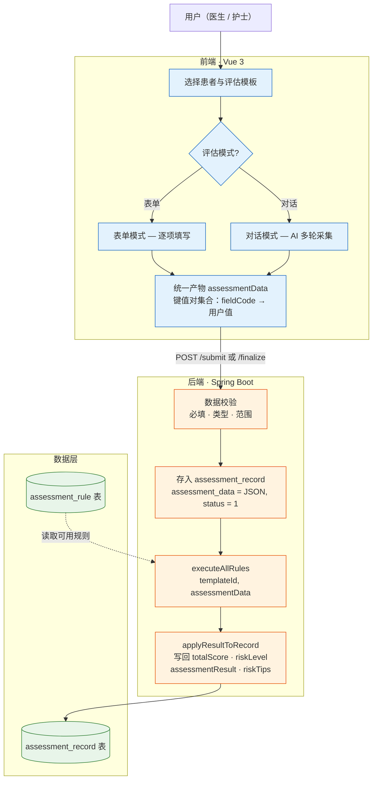
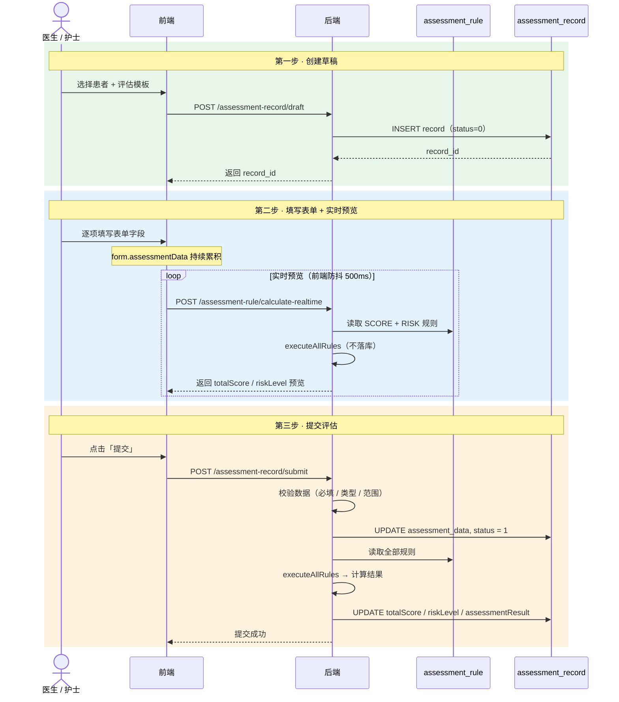
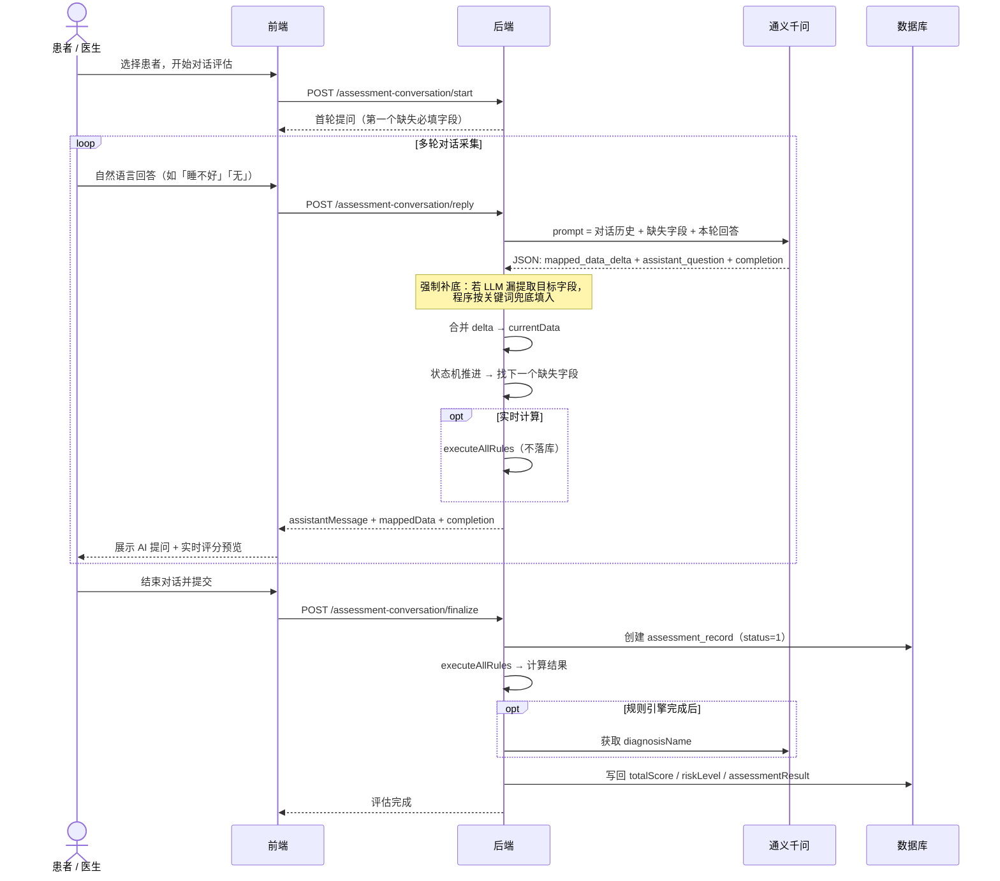
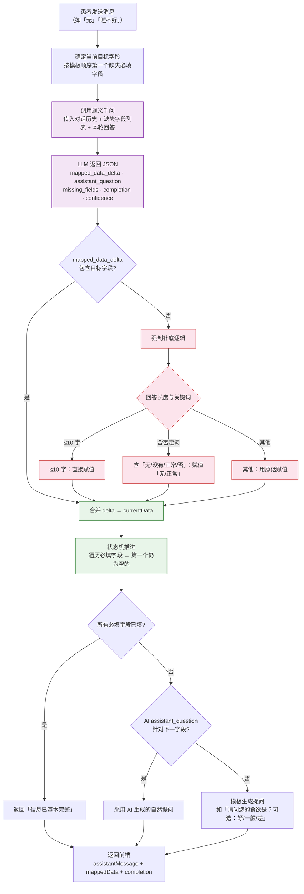
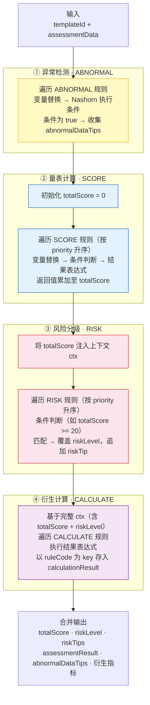
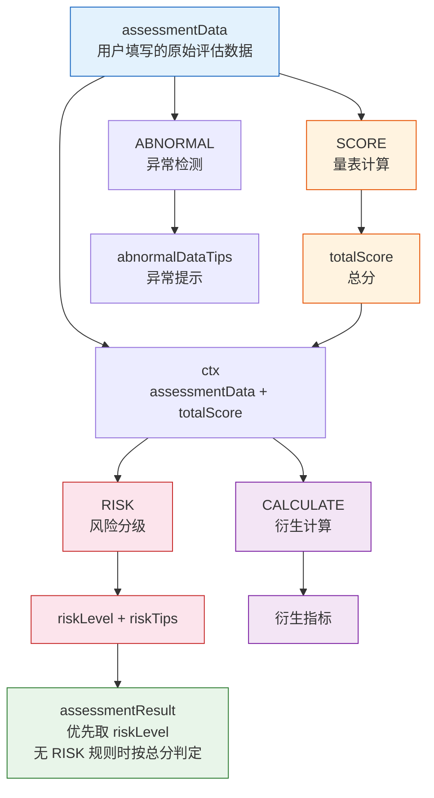
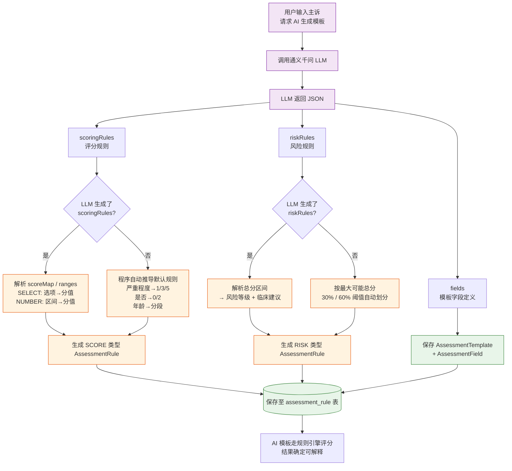
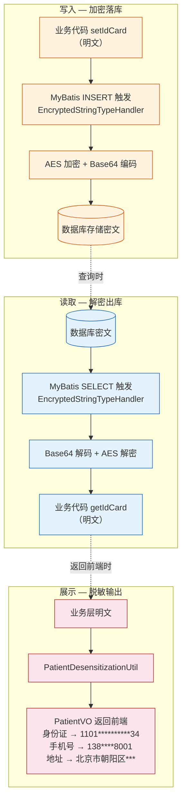
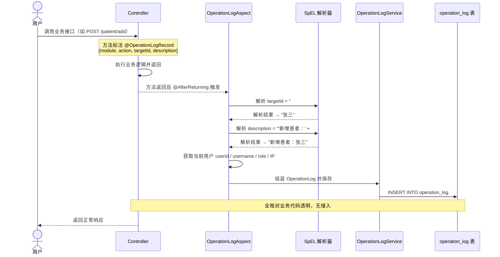

# 核心数据流图

> 本文档覆盖 `docs/study/` 全部技术文档中描述的数据流转逻辑，按 **评估流程 → 规则引擎 → AI 能力 → 安全机制** 四大主题分组绘制。

---

## 1. 评估数据全局流转

用户操作产出 `assessmentData`，经后端校验、规则引擎计算后将评估结果落库的完整端到端链路。

---

## 2. 表单模式评估时序

从创建草稿到提交评估、规则计算并写回结果的完整交互时序，含实时计算预览。

---

## 3. 对话式评估与 LLM 结构化解析

AI 通过多轮对话采集评估数据，每轮由 LLM 解析用户回答为 `mapped_data_delta` 增量数据并合并，最终走同一套规则引擎计算。

---

## 4. 单轮对话详细处理流程

一轮对话内部的完整处理链：LLM 解析 → 强制补底 → 合并数据 → 状态机推进 → 生成下轮提问。

---

## 5. 规则引擎执行管线（executeAllRules）

按固定顺序执行四类规则，每阶段的输入依赖上阶段的输出。规则存储在数据库中，通过 Nashorn 脚本引擎执行 `${fieldCode}` 变量替换后的 JavaScript 表达式。

---

## 6. 规则模块数据依赖与执行顺序

四类规则之间的数据流向与依赖关系，决定了不可颠倒的执行顺序：SCORE 不依赖 RISK，RISK 依赖 totalScore，CALCULATE 可依赖前面所有输出。

---

## 7. 实时计算与提交计算对比

两种计算场景使用同一套 `executeAllRules` 逻辑，区别仅在于是否将结果持久化到数据库。

```mermaid
flowchart TD
    subgraph RT["实时计算 · 预览 · 不落库"]
        RT1["用户每次输入\n前端防抖 500ms"]
        RT2["POST /calculate-realtime"]
        RT3["executeAllRules"]
        RT4["返回 totalScore / riskLevel"]
        RT5["前端展示预览\n提升用户填写体验"]
        RT1 --> RT2 --> RT3 --> RT4 --> RT5
    end

    subgraph SM["提交计算 · 落库"]
        SM1["用户点击提交"]
        SM2["POST /submit 或 /finalize"]
        SM3["校验 + 存 assessmentData\nstatus = 1"]
        SM4["executeAllRules"]
        SM5["结果写回 assessment_record\ntotalScore · riskLevel · assessmentResult"]
        SM1 --> SM2 --> SM3 --> SM4 --> SM5
    end

    classDef rt fill:#e3f2fd,stroke:#1565c0
    classDef sm fill:#fff3e0,stroke:#e65100
    class RT1,RT2,RT3,RT4,RT5 rt
    class SM1,SM2,SM3,SM4,SM5 sm
```

---

## 8. AI 自动生成模板与规则

当用户选择「AI 根据主诉生成模板」时，LLM 同步输出模板字段、评分规则和风险规则，程序负责标准化与兜底补充，确保 AI 模板也能走规则引擎评分。

---

## 9. 敏感字段加密与脱敏三层数据流

患者敏感信息（身份证、手机、地址等）在存储、业务、展示三层采用不同形态，通过 MyBatis TypeHandler + AES 实现对业务代码零侵入。

---

## 10. 审计日志 AOP 记录流程

通过 `@OperationLogRecord` 注解 + AOP 切面实现声明式审计日志，方法执行成功后自动解析 SpEL 表达式并记录操作日志，业务方法无需手动编写日志代码。

