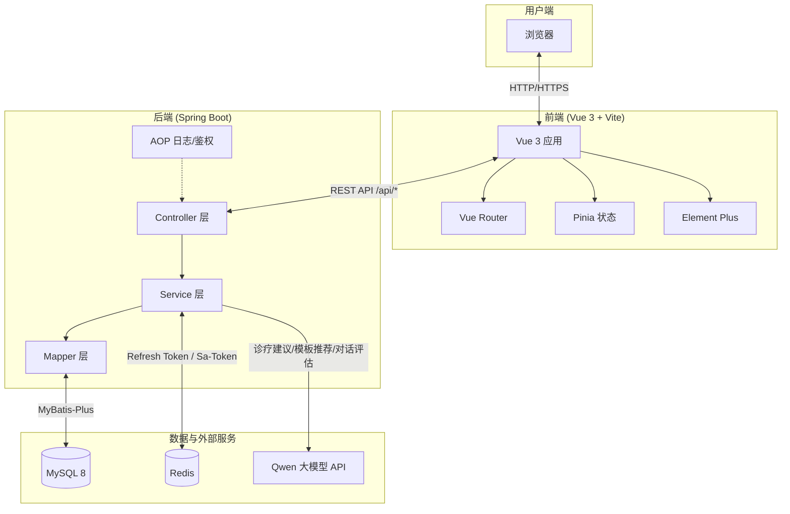
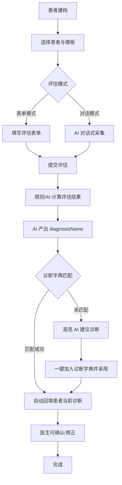
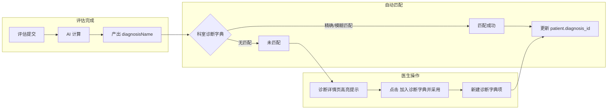
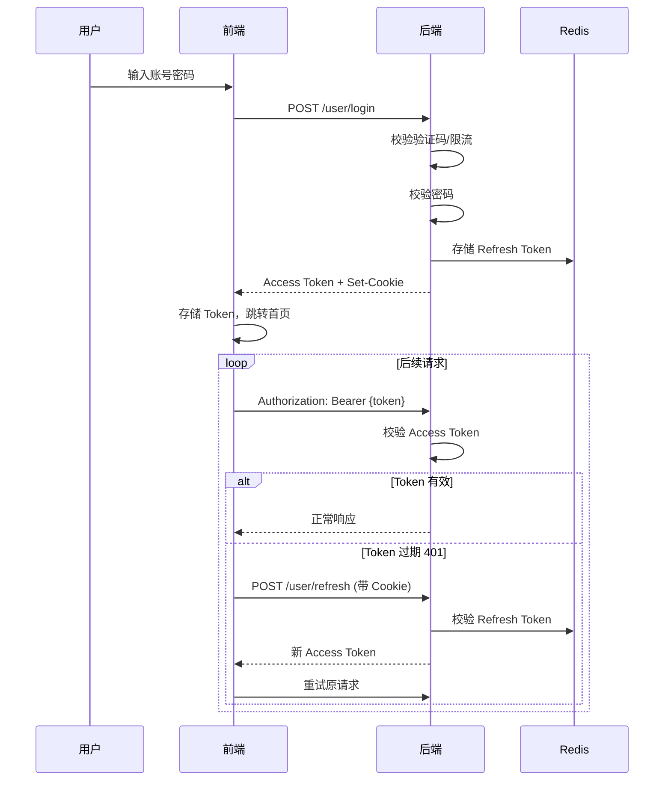
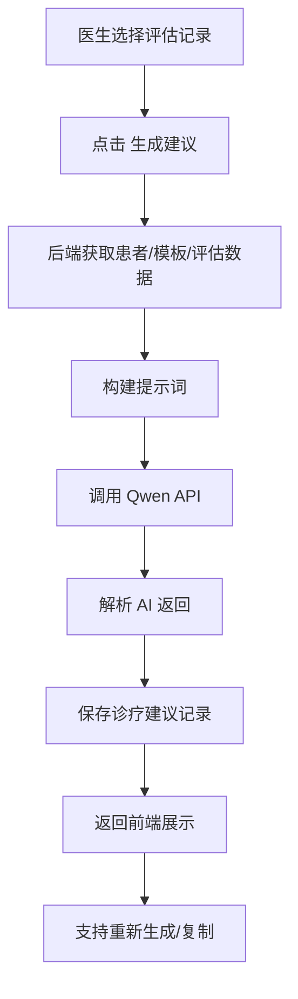

# 系统架构图与工作流程图

本文档提供智安临评系统的架构图与核心工作流程的 Mermaid 源码，便于在文档、答辩或导出为图片时使用。

> 更详细的 10 张核心数据流图（评估流程、规则引擎、AI 能力、安全机制）见 [core-data-flows.md](core-data-flows.md)。

## 1. 系统架构图

## 2. 患者评估与诊断确认流程

## 3. AI 诊断与诊断字典联动流程

## 4. 登录与会话续期流程

## 5. 诊疗建议生成流程

## 使用说明

- 上述 Mermaid 图可在支持 Mermaid 的 Markdown 渲染器中直接显示（如 GitHub、GitLab、Typora、VS Code 插件等）。
- 如需导出为 PNG/SVG，可使用 [Mermaid Live Editor](https://mermaid.live/) 或 VS Code 的 Mermaid 插件。
- 导出图片后可放入 `docs/images/` 目录，供 README 或答辩材料引用。
